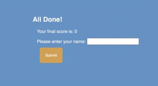

# challenge-4-assessment
Make a timed quiz that saves your quiz answer results. For incorrectly given answers the timer will lose time. The game ends once all questions are answered or the timer reaches zero.

## Description
Once the quiz has started a timer will start counting down. Presented infront of the user will be a series of questions referring to JavaScript fundamentals. When the user gets an answer correct they will be presented with a correct answer indicator and an audible noise will play. If the user gets an answer incorrect the timer will drop 10 seconds off of their time as well as play a different audible nose with a worng answer message shown. The game will end when the user has answered all of the questions or the timer has run out. The user will then be presented with their score as well as previous high-scores.

Wesbite live at: <href="">

## Badges
N/A
## Visuals
To start the quiz the user will click the start quiz button and a timmer will begin. 

Once the user has answered all of the questions or the timer has gotten to zero the quiz will end and the user will have the option to save their score to the scoreboard.

## Installation
Made using the latest versions of GitHub and Visual Studio Code.

## Usage
When the user clicks the start quiz button they will be shown a series of questions relating to JavaScript. The user will select their choice and if incorrec the time will be deducted ten seconds. Once the game has ended the user can input their score to a local leaderboard.

## Support
For support email: jkrieger11@gmail.com.

## Roadmap
Application in process, updates coming daily for next few weeks. 3/20/23.

## Authors and acknowledgment
Jake Krieger
[GitHub](https://github.com/jkrieger6?tab=repositories "GitHub Home")
## License
N/A

## Project status
Currently in progress.
